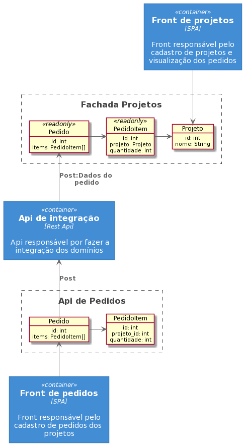

# Desafio Guararapes

Criar um conjunto de API's baseado no desenho abaixo. A idéia consiste em criar uma api de projetos que recebe dados de projeto de um front espeífico para ele e poderá visualizar os pedidos por aquele projeto, porém a criação de pedidos se dá por outro frontend especializado com sua própria API, os dados de pedido serão então replicados para a api de pedidos para ganhar mais agilidade nas pesquisas. Toda a integração deve ser realizada por um componente central uqe transfere os dados de um lado para o outro.
É importante ressaltar que não precisa criar os fronts apenas as APIs, porém se realizar o front também será um bonus interessante.

Os seguintes frameworks podem ser usados nos componentes (é possível usar um para cada api criada):
* [Spring Boot](https://spring.io/projects/spring-boot)
* [Django Rest](https://www.django-rest-framework.org/)
* [NestJS](https://nestjs.com/)

Segue o desenho:

## Diferenciais
* Testes unitários com coverage acima de 50%
* Código limpo e lintado
* Usar Kafka na api de integração
* Criar os fronts
* Documentação de cada api, como rodar e como testar em um README.md
